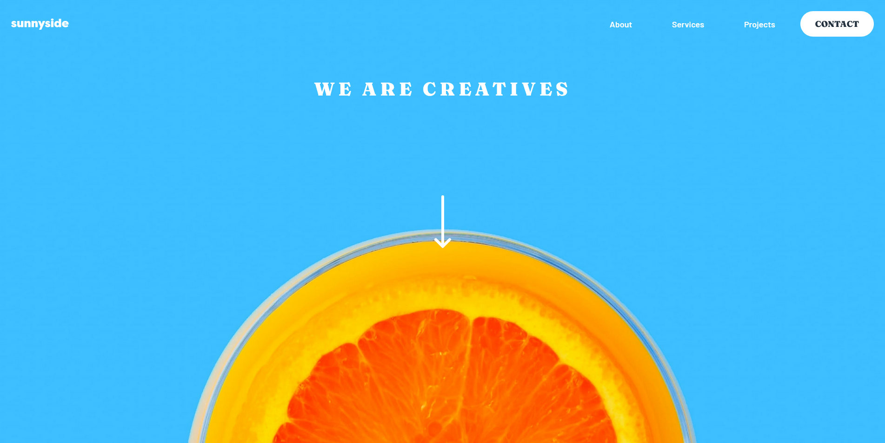

# Frontend Mentor - Sunnyside agency landing page solution

This is a solution to the [Sunnyside agency landing page challenge on Frontend Mentor](https://www.frontendmentor.io/challenges/sunnyside-agency-landing-page-7yVs3B6ef). Frontend Mentor challenges help you improve your coding skills by building realistic projects.

## Table of contents

- [Overview](#overview)
  - [The challenge](#the-challenge)
  - [Screenshot](#screenshot)
  - [Links](#links)
- [My process](#my-process)
  - [Built with](#built-with)
  - [What I learned](#what-i-learned)
  - [Useful resources](#useful-resources)
- [Author](#author)

## Overview

### The challenge

Users should be able to:

- View the optimal layout for the site depending on their device's screen size
- See hover states for all interactive elements on the page

### Screenshot

### Links

- Solution URL: [Solution URL](https://www.frontendmentor.io/solutions/sunnyside-agency-landing-page-c_iezlLsUg)
- Live Site URL: [Live Site URL](https://klaudia-czerska.github.io/sunnyside-agency-landing-page-main/)

## My process

### Built with

- Semantic HTML5 markup
- CSS custom properties
- Flexbox
- CSS Grid
- Mobile-first workflow

### What I learned

I have learned a lot on creating layouts. I really liked the mobile-first workflow, it is a great tool to create a responsive apps.

### Useful resources

- [Kevin Powell - 5 simple tips to making responsive layouts the easy way](https://www.youtube.com/watch?v=VQraviuwbzU) - I love Kevin's work, his yt channel really helped me with my CSS journey. Here he talks about using media queries to add complexity, not remove it - as I was doing it previously.

## Author

- Frontend Mentor - [@Klaudia-Czerska](https://www.frontendmentor.io/profile/Klaudia-Czerska)

